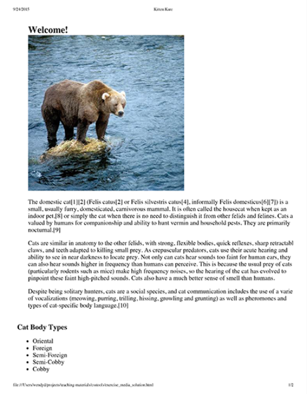

# &#9889; Atividades de Fixação & Exercícios | Bloco 06 - Dia 05

## &#9989; Atividade de Fixação - Media Query
1. A primeira `div` só poderá aparecer se nossa tela possuir **largura mínima de 500px**.
```
@media screen and (min-width: 500px) {
  .card:nth-of-type(1) {
    display: flex;
  }
}
```

2. A segunda `div` só poderá aparecer apenas se a **largura estiver entre 600px e 1000px**.
```
@media screen and (min-width: 600px) and (max-width: 1000px) {
  .card:nth-of-type(2) {
    display: flex;
  }
}
```

3. A terceira `div` não deverá aparecer se nossa tela possuir **largura entre 650px e 950px**.
```
@media not screen and (min-width: 650px) and (max-width: 950px) {
  .card:nth-of-type(3) {
    display: flex;
  }
}
```

4. Sem alterar a classe trick, faça com que o texto dela apareça somente quando a tela estiver com **menos de 500px de largura**.
```
@media screen and (max-width: 500px) {
  p.trick {
    color: #525252;
  }
}
```

## &#9989; Exercício do Dia - Parte I
1. Faça o **tamanho da fonte** ser maior;
```
body {
  font-size: 1.4em;
}
```

2. Faça o tamanho da fonte dos elementos `h1` ser menor;
```
h1 {
  font-size: 1.7em;
}
```

3. Aumente o **espaçamento entre as figuras**;
```
figure {
	margin-bottom: 30px;
}
```

4. Adicione um pouco de `margin` na página.
```
*, *:before, *:after {
  box-sizing: inherit;
  margin: 7px;
}
```

5. Guarde a largura da tela no ponto que você identificou que o layout atual não funcionou bem. Esse será o **primeiro breakpoint** do layout. Um breakpoint é apenas um ponto onde estamos definindo que o design atual deve mudar;
- Breakpoint: 522px.

6. Crie uma `media query` no seu arquivo CSS, usando a dimensão em pixels que você guardou como o `min-width` do teste da media query. Dentro desse **breakpoint**, adicione os seguintes ajustes:
- Altere a **cor de fundo**;
```
@media screen and (min-width: 522px) {
  body {
    background-color: wheat;
  }
}
```

- Ajuste o **tamanho da fonte**;
```
@media screen and (min-width: 522px) {
  body {
    font-size: 1.5em;
  }

  h1 {
    font-size: 1.75em;
  }
}
```

- Ajuste as **margens da página**;
```
@media screen and (min-width: 522px) {
  *, *:before, *:after {
    box-sizing: inherit;
    margin: 16px 8px 0;
  }
}
```

- Faça as **imagens** serem mostradas em **duas colunas**.
```
@media screen and (min-width: 522px) {
  section {
    align-items: center;
    display: flex;
    flex-wrap: wrap;
    justify-content: center;
    max-width: 100%;
  }

  figure {
    align-items: center;
    display: flex;
    flex-direction: column;
    margin-bottom: 10px;
    width: 45%;
  } 
}
```

7. Agora, você vai criar **outro breakpoint** para **telas grandes**. Redimensione sua tela de novo para encontrar um novo breakpoint.
- Breakpoint: 1.054px.


8. Crie uma nova `media query` no seu arquivo CSS usando a dimensão que você encontrou para **telas grandes**, e realize os seguintes ajustes dentro do breakpoint:
- Altere a **cor de fundo**;
```
@media screen and (min-width: 1054px) {
  body {
    background-color: orangered;
  }
}
```

- Ajuste o **tamanho da fonte**;
```
@media screen and (min-width: 1054px) {
  body {
    font-size: 1.6em;
  }

  h1 {
    font-size: 1.8em;
  }
}
```

- Ajuste as **margens da página**;
```
@media screen and (min-width: 1054px) {
  *, *:before, *:after {
    box-sizing: inherit;
    margin: 17px 9px 0;
  }
}
```

- Adicione a propriedade `max-width` à página, para garantir que a largura das linhas não fique muito grande.
```
@media screen and (min-width: 1054px) {
  body {
    max-width: 1522px;
  }
}
```

## &#9989; Exercício do Dia - Parte II
- Utilizando a abordagem **mobile first** e **media queries**, crie **três versões de layout diferentes**. Cada layout deve corresponder a um tamanho diferente de página (pequeno, médio e grande).
- Para fazer isso de forma adequada, deve-se prestar atenção no conteúdo da página e pensar em como mostrá-lo em cada um dos tamanhos de tela:
  - Onde a lista de capítulos deve estar posicionada?
  - Como a história deve ser mostrada?
  - Como o cabeçalho deve ser posicionado?
  - O que fazer com as informações do autor em cada tamanho de tela?
- Talvez seja necessário alterar o HTML um pouco, adicionando elementos para facilitar a estilização, ou talvez mudando um bloco de lugar dentro da página.

1. Layout **pequeno**.
```
@media screen and (min-width:322px) and (max-width:599px) {
  *, *:before, *:after {
    font-size: 18px;
  }

  header {
    align-items: center;
    background-color: rgb(219, 216, 216);
    display: flex;
    flex-direction: column;
    height: 90px;
    justify-content: center;
    left: 0;
    padding-top: 10px;
    position: fixed;
    top: 0;
    width: 100%;
  }

  header p {
    font-weight: 800;
  }

  header nav {
    align-items: center;
    display: flex;
    flex-direction: row;
    justify-content: center;
    width: 100%;
  }

  header nav ul {
    align-items: center;
    display: flex;
    justify-content: space-evenly;
    margin-top: 0;
    padding: 0;
    width: 100%;
  }

  header nav ul li {
    list-style: none;
  }

  .container {
    display: flex;
    flex-direction: column;
    justify-content: center;
    margin: 0 20px;
  }

  #asides {
    display: flex;
    flex-direction: column;
    margin-top: 100px;
    order: 0;
  }

  #asides h2 {
    text-align: center;
    font-size: 1.2em;
  }
  
  .main-content {
    display: flex;
    flex-direction: column;
    justify-content: center;
    order: 1;
  }

  .main-content h1 {
    font-size: 1.4em;
    text-align: center;
  }

  .main-content p {
    text-align: justify;
  }

  footer {
    background-color: black;
    color: whitesmoke;
    text-align: justify;
    padding: 5px 20px;
  }
}
```

2. Layout **médio**.
```
@media screen and (min-width:600px) and (max-width:899px) {

  *, *:before, *:after {
    font-size: 18px;
  }

  header {
    background-color: rgb(219, 216, 216);
    display: flex;
    align-items: center;
    height: 90px;
    width: 100%;
    margin-bottom: 30px;
  }

  header p {
    display: flex;
    font-weight: 800;
    justify-content: center;
    width: 50%;
  }

  header nav {
    align-items: center;
    display: flex;
    flex-direction: row;
    width: 50%;
  }

  header nav ul {
    align-items: center;
    display: flex;
    justify-content: space-evenly;
    padding: 0;
    width: 100%;
  }

  header nav ul li {
    list-style: none;
  }

  .container {
    display: flex;
    flex-direction: column;
    justify-content: center;
  }

  #asides {
    display: flex;
    justify-content: space-evenly;
    order: 0;
    margin: 0 20px 30px;
  }

  #asides h2 {
    text-align: center;
    font-size: 1.3em;
  }
  
  .main-content {
    display: flex;
    flex-direction: column;
    justify-content: center;
    margin: 0 40px 30px;
    order: 1;
  }

  .main-content h1 {
    font-size: 1.5em;
    text-align: center;
  }

  .main-content p {
    text-align: justify;
  }

  footer {
    background-color: black;
    color: whitesmoke;
    text-align: justify;
    padding: 5px 20px;
  }
}
```

3. Layout **grande**.
```
@media screen and (min-width:900px) and (max-width:1299px) {

  *, *:before, *:after {
    font-size: 19px;
  }

  header {
    background-color: rgb(219, 216, 216);
    display: flex;
    align-items: center;
    height: 90px;
    width: 100%;
    margin-bottom: 30px;
  }

  header p {
    display: flex;
    font-weight: 800;
    justify-content: center;
    width: 50%;
  }

  header nav {
    align-items: center;
    display: flex;
    flex-direction: row;
    width: 50%;
  }

  header nav ul {
    align-items: center;
    display: flex;
    justify-content: space-evenly;
    padding: 0;
    width: 100%;
  }

  header nav ul li {
    list-style: none;
  }

  .container {
    display: flex;
    margin: 0 40px 30px;
  }

  #asides {
    display: flex;
    flex-direction: column;
    align-items: center;
    justify-content: baseline;
    top: 0;
    height: 100%;
    position: sticky;
    width: 25%;
  }

  #asides h2 {
    text-align: center;
    font-size: 1.1em;
  }

  #asides ul li{
    font-size: 0.9em;
  }
  
  .main-content {
    display: flex;
    flex-direction: column;
    width: 75%;
  }

  .main-content h1 {
    font-size: 1.5em;
    text-align: center;
  }

  .main-content p {
    text-align: justify;
  }

  footer {
    background-color: black;
    color: whitesmoke;
    text-align: justify;
    padding: 5px 20px;
  }
}
```

4. Layout **mínimo** (Adicional).
```
@media screen and (max-width:321px) {
  *, *:before, *:after {
    font-size: 16px;
  }

  header {
    align-items: center;
    background-color: rgb(219, 216, 216);
    display: flex;
    flex-direction: column;
    height: 70px;
    justify-content: center;
    left: 0;
    padding-top: 10px;
    position: fixed;
    top: 0;
    width: 100%;
  }

  header p {
    font-weight: 800;
    text-align: center;
    margin-bottom: 10px;
  }

  header nav {
    align-items: center;
    display: flex;
    flex-direction: row;
    justify-content: center;
    width: 100%;
  }

  header nav ul {
    align-items: center;
    display: flex;
    justify-content: space-evenly;
    margin-top: 0;
    padding: 0;
    width: 100%;
  }

  header nav ul li {
    list-style: none;
  }

  .container {
    display: flex;
    flex-direction: column;
    justify-content: center;
    margin: 0 10px;
  }

  #asides {
    display: flex;
    flex-direction: column;
    margin-top: 100px;
    order: 0;
  }

  #asides h2 {
    text-align: center;
    font-size: 1em;
  }
  
  .main-content {
    display: flex;
    flex-direction: column;
    justify-content: center;
    order: 1;
  }

  .main-content h1 {
    font-size: 1.2em;
    text-align: center;
  }

  .main-content p {
    text-align: justify;
  }

  footer {
    background-color: black;
    color: whitesmoke;
    text-align: justify;
    padding: 5px 20px;
  }
}
```

5. Layout **máximo** (Adicional).
```
@media screen and (min-width:1300px) {

  *, *:before, *:after {
    font-size: 20px;
  }

  header {
    background-color: rgb(219, 216, 216);
    display: flex;
    align-items: center;
    height: 90px;
    width: 100%;
    margin-bottom: 30px;
  }

  header p {
    display: flex;
    font-weight: 800;
    justify-content: center;
    width: 50%;
  }

  header nav {
    align-items: center;
    display: flex;
    flex-direction: row;
    width: 50%;
  }

  header nav ul {
    align-items: center;
    display: flex;
    justify-content: space-evenly;
    padding: 0;
    width: 100%;
  }

  header nav ul li {
    list-style: none;
  }

  .container {
    display: flex;
    margin: 0 50px 30px;
  }

  #asides {
    align-items: center;
    display: flex;
    flex-direction: column;
    height: 100%;
    justify-content: baseline;
    position: sticky;
    top: 0;
    width: 20%;
  }

  #asides h2 {
    font-size: 1.3em;
    text-align: center;
  }

  #asides ul li{
    font-size: 1em;
  }
  
  .main-content {
    display: flex;
    flex-direction: column;
    width: 80%;
  }

  .main-content h1 {
    font-size: 1.5em;
    text-align: center;
  }

  .main-content p {
    text-align: justify;
  }

  footer {
    background-color: black;
    color: whitesmoke;
    text-align: justify;
    padding: 5px 20px;
  }
}
```

## &#9989; Exercício do Dia - Parte III
- O objetivo deste exercício é usar **media queries** para fazer a página parecer diferente na hora da **impressão** e em diferentes tamanhos de tela.

1. Adicione uma `media query` no arquivo CSS e as regras necessárias para que a página se pareça com a imagem abaixo quando ela for impressa. Especificamente:
- Os elementos com `id header`, `navigation` e `footer` devem **desaparecer**;
- O elemento com `id aside` deve ser mostrado **abaixo** do **conteúdo principal**.


```

```

2. Adicione uma `media query` no arquivo CSS e as regras necessárias para que a página se pareça com as imagens abaixo quando a tela for redimensionada para **larguras menores**. Especificamente:
- O elemento com `id aside` deve **desaparecer**;
- O elemento `body` **não** deve ter `padding`;
- As **imagens não** devem exceder a **largura da tela**;
- Os **itens** dentro do elemento `navigation` devem aparecer cada um em sua **própria linha**;
- O elemento com `id header` deve ser **fixo**, de forma que ele fique aparecendo **sempre no topo da tela** mesmo após a pessoa usuária rolar a página.


```

```