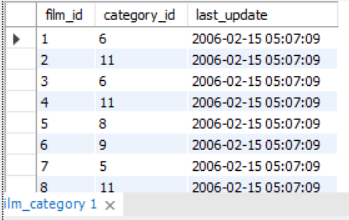

# &#9889; Atividades de Fixação & Exercícios | Bloco 20 - Dia 01 (Seção 02)

## &#9989; Atividades de Fixação | Constraints (restrições), chaves primárias e chaves estrangeiras
#### Sem ter acesso à estrutura interna de como as tabelas a seguir foram criadas, responda as perguntas.

### Tabela 01

#### 1. Quais constraints a coluna `address_id` poderia ter? Por quê?
R. PRIMARY KEY e, por definição, NOT NULL e UNIQUE também, tendo em vista que é um identificador único.

#### 2. A coluna `city_id` é um número. Consegue identificar que tipo de constraint foi aplicado a ela?
R. Fora aplicada a constraint FOREIGN KEY, tendo em vista que ela aparentemente pertence à uma tabela externa.

#### 3. A coluna `address` (endereço) possui uma constraint. Qual tipo de constraint seria interessante ser aplicado a ela para que sempre exista um valor na coluna quando uma nova linha for criada?
R. NOT NULL, garantindo a inserção de um valor válido e coerente para a linha.

### Tabela 02

#### 1. Que tipo de constraint a coluna `city_id` possui?
R. PRIMARY KEY, pois é um identificador único.

#### 2. Qual é o motivo de a coluna `country_id` não possuir nomes de country (país)? Ela é algum tipo de chave primária ou estrangeira?
R. A coluna country_id traz os identificadores únicos (PRIMARY KEY) da sua tabela originária. Para consultar os nomes dos países, será necessário consultar tal tabela. No contexto da tabela atual, esta coluna recebe a constraint FOREIGN KEY.

### Tabela 03

#### 1. Qual coluna possui uma primary key?
R. Coluna film_id.

#### 2. Qual coluna possui uma foreign key?
R. Coluna category_id.

## &#9989; Exercícios do dia
#### 1. Descubra como fazer uma pesquisa em qualquer tabela sem utilizar uma linha de código usando o MySql Workbench.
R. Clicar com o botão direito na tabela desejada e selecionar a opção "Select Rows - Limit...".

#### 2. Descubra como é possível criar uma tabela sem usar código SQL usando o MySql Workbench.
R. Clicar com o botão direito na opção "Tables" do BD em questão e selecionar a opção "Create Table..."

#### 3. Feito isso, crie uma tabela com as seguintes restrições:
- Nome da tabela: `filme`
- Colunas:
  - `filme_id` - primary key, tipo int, incrementa por 1 cada vez que um valor é inserido automaticamente;
  - `descricao` - não permite nulos, tipo texto (varchar(100));
  - `ano_lancamento` - não permite nulos, tipo int;
  - `nota` - permite nulos, tipo int.

R.:

#### 4. Analise a tabela `city` e encontre a tabela à qual a coluna `country_id` faz referência.
R.: Tabela country.

#### 5. Após resolver o exercício anterior, responda: qual tipo de relacionamento a tabela `city` faz com a tabela `country`?
R.: Relacionamento N:1 → Várias cidades referenciam a um único país.

#### 6. Qual tipo de relacionamento a tabela `country` faz com a tabela `city`?
R.: Relacionamento 1:N → Um país se refere a várias cidades.

#### 7. Abra tabela por tabela do banco sakila e encontre no mínimo 3 exemplos de um relacionamentos 1:N ou N:1.
R.: address e city; customer e store; film e category.