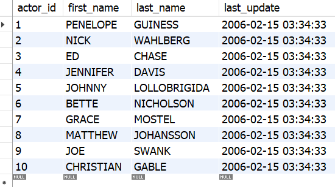

# &#9889; Atividades de Fixação & Exercícios | Bloco 20 - Dia 02 (Seção 02)

## &#9989; Atividades de Fixação | SELECT, o primeiro passo

#### 1. Monte uma query que exiba seu nome na tela.
```
SELECT 'Guilherme';
```

#### 2. Monte uma query que exiba seu nome, sobrenome, cidade natal e idade na tela.
```
SELECT 'Guilherme', 'Garcia', 'Porto Feliz/SP', 23;
```

#### 3. Monte uma query que, além de exibir todas as informações já mencionadas, identifique cada coluna usando o `AS`.
```
SELECT 'Guilherme' AS Nome, 'Garcia' AS Sobrenome, 'Porto Feliz/SP' as Cidade, 23 as Idade;
```

#### 4. Qual é o resultado de 13 * 8 ? Descubra usando apenas o `SELECT`.
R.: 104.
```
SELECT 13 * 8;
```

#### 5. Monte uma query que exiba a data e hora atuais. Dê a essa coluna o nome “Data Atual”.
```
SELECT now() AS 'Data Atual';
```

### Considerando o banco de dados sakila, encontre as seguintes informações montando uma query para cada uma.

#### 6. Escreva uma query que selecione todas as colunas da tabela `city`.
```
SELECT * FROM sakila.city;
```

#### 7. Escreva uma query que exiba apenas as colunas `first_name` e `last_name` da tabela `customer`.
```
SELECT first_name, last_name FROM sakila.customer;
```

#### 8. Escreva uma query que exiba todas as colunas da tabela `rental`.
```
SELECT * FROM sakila.rental;
```

#### 9. Escreva uma query que exiba o título, a descrição e a data de lançamento dos filmes registrados na tabela film.
```
SELECT title, description, release_year FROM sakila.film;
```

## &#9989; Atividades de Fixação | CONCAT - Juntando duas ou mais colunas
#### 1. Na tabela `sakila.film`, monte uma query que exiba o título e o ano de lançamento dos filmes em uma coluna e dê a ela o nome "Lançamento do Filme".
```
SELECT CONCAT(title,' - ', release_year) AS "Lançamento do Filme" FROM sakila.film;
```

#### 2. Na tabela `sakila.film`, crie uma query que exiba o título do filme e sua classificação indicativa (PG, G, NC-17) em apenas uma coluna. Dê a ela o nome "Classificação". Não se esqueça de deixar um espaço entre as palavras para que fiquem legíveis.
```
SELECT CONCAT(title,' - ', rating) AS Classificação FROM sakila.film;
```

#### 3. Na tabela `sakila.address`, monte uma query que exiba a rua e o distrito de cada registro em uma coluna apenas, e dê a essa coluna o nome "Endereço".
```
SELECT CONCAT(address,' - ', district) AS Endereço FROM sakila.address;
```

## &#9989; Atividades de Fixação | DISTINCT - Evitando dados repetidos
### Considerando a tabela Estudantes do banco de dados Escola, indique as queries para encontrar os dados a seguir.

#### 1. Monte uma query para encontrar pares únicos de nomes e idades. Quantas linhas foram encontradas?
```
SELECT DISTINCT Nome, Idade FROM Escola.Estudantes;

-- Todas as linhas foram retornadas: 05.
```

#### 2. Monte uma query para encontrar somente os nomes únicos. Quantas linhas foram encontradas?
```
SELECT DISTINCT Nome FROM Escola.Estudantes;

-- Linhas retornadas: 04.
```

#### 3. Monte uma query para encontrar somente as idades únicas. Quantas linhas foram encontradas?
```
SELECT DISTINCT Idade FROM Escola.Estudantes;

-- Linhas retornadas: 04.
```

## &#9989; Atividades de Fixação | COUNT - Contando resultados
### Considerando a tabela staff do banco de dados sakila, responda às seguintes questões.

#### 1. Quantas senhas temos cadastradas nessa tabela?
```
SELECT COUNT(password) FROM sakila.staff;

-- Retorno: 01.
```

#### 2. Quantas pessoas temos no total trabalhando para nossa empresa?
```
SELECT COUNT(*) FROM sakila.staff;

-- Retorno: 02.
```

#### 3. Quantos emails temos cadastrados nessa tabela?
```
SELECT COUNT(email) FROM sakila.staff;

-- Retorno: 02.
```

## &#9989; Atividades de Fixação | LIMIT OFFSET - Pulando linhas desnecessárias

#### Considerando a tabela acima, qual query poderia ser utilizada para trazer os 10 primeiros resultados, a partir de `JOHNNY`?
```
SELECT * FROM sakila.actor LIMIT 10 OFFSET 4;
```

## &#9989; Atividades de Fixação | Juntando tudo que vimos hoje
### Para os exercícios a seguir, vamos usar a tabela `sakila.film`:

#### 1. Escreva uma query que exiba todos os filmes cadastrados no banco de dados.
```
SELECT * FROM sakila.film;
```

#### 2. Escreva uma query que exiba apenas o nome dos filmes, seu ano de lançamento e sua classificação.
```
SELECT title, release_year, rating FROM sakila.film;
```

#### 3. Quantos filmes temos cadastrados?
```
SELECT COUNT(*) FROM sakila.film;

-- Retorno: 1000.
```

### Para os exercícios a seguir, vamos usar a tabela sakila.actor:

#### 4. Escreva uma query que exiba apenas os sobrenomes únicos cadastrados.
```
SELECT DISTINCT last_name FROM sakila.actor;
```

#### 5. Quantos sobrenomes únicos temos na tabela?
```
SELECT COUNT(DISTINCT last_name) FROM sakila.actor;

-- Retorno: 121.
```

#### 6. Ordene os valores na tabela em ordem crescente de sobrenomes e em ordem decrescente de nome.
```
SELECT * FROM sakila.actor
ORDER BY last_name ASC, first_name DESC;
```

### Usando a tabela `language`:

#### 7. Crie uma pesquisa que mostre os 5 idiomas cadastrados, mas não mostre o idioma english.
```
SELECT * FROM sakila.language LIMIT 10 OFFSET 1;

-- 0R

SELECT * FROM sakila.language
WHERE name != 'English';
```

### Usando a tabela `film`:

#### 8. Selecione todos os dados da tabela e faça o seguinte: Crie uma query para encontrar os 20 primeiros filmes, incluindo o título, o ano de lançamento, a duração, a classificação indicativa e o custo de substituição. Ordene os resultados pelos filmes com a maior duração e depois pelo menor custo de substituição.
```
SELECT title, release_year, length, rating, replacement_cost 
FROM sakila.film
ORDER BY length DESC, replacement_cost ASC
LIMIT 20;
```

## &#9989; Exercícios do Dia
#### Restaure o banco de dados abaixo e responda as questões a seguir. Esse banco de dados é de uso livre, sendo licenciado de acordo com os termos [deste link](https://creativecommons.org/licenses/by-sa/3.0/).
```
DROP SCHEMA IF EXISTS Scientists;
CREATE SCHEMA Scientists;
USE Scientists;
CREATE TABLE Scientists (
  SSN INT,
  Name CHAR(30) NOT NULL,
  PRIMARY KEY (SSN)
);
CREATE TABLE Projects (
  Code CHAR(4),
  Name CHAR(50) NOT NULL,
  Hours INT,
  PRIMARY KEY (Code)
);
CREATE TABLE AssignedTo (
  Scientist INT NOT NULL,
  Project CHAR(4) NOT NULL,
  PRIMARY KEY (Scientist, Project),
  FOREIGN KEY (Scientist) REFERENCES Scientists (SSN),
  FOREIGN KEY (Project) REFERENCES Projects (Code)
);
INSERT INTO Scientists(SSN,Name)
  VALUES(123234877, 'Michael Rogers'),
    (152934485, 'Anand Manikutty'),
    (222364883, 'Carol Smith'),
    (326587417, 'Joe Stevens'),
    (332154719, 'Mary-Anne Foster'),
    (332569843, 'George ODonnell'),
    (546523478, 'John Doe'),
    (631231482, 'David Smith'),
    (654873219, 'Zacary Efron'),
    (745685214, 'Eric Goldsmith'),
    (845657245, 'Elizabeth Doe'),
    (845657246, 'Kumar Swamy');
 INSERT INTO Projects (Code, Name, Hours)
  VALUES ('AeH1' ,'Winds: Studying Bernoullis Principle', 156),
    ('AeH2', 'Aerodynamics and Bridge Design', 189),
    ('AeH3', 'Aerodynamics and Gas Mileage', 256),
    ('AeH4', 'Aerodynamics and Ice Hockey', 789),
    ('AeH5', 'Aerodynamics of a Football', 98),
    ('AeH6', 'Aerodynamics of Air Hockey', 89),
    ('Ast1', 'A Matter of Time', 112),
    ('Ast2', 'A Puzzling Parallax', 299),
    ('Ast3', 'Build Your Own Telescope', 6546),
    ('Bte1', 'Juicy: Extracting Apple Juice with Pectinase', 321),
    ('Bte2', 'A Magnetic Primer Designer', 9684),
    ('Bte3', 'Bacterial Transformation Efficiency', 321),
    ('Che1', 'A Silver-Cleaning Battery', 545),
    ('Che2', 'A Soluble Separation Solution', 778);
 INSERT INTO AssignedTo (Scientist, Project)
  VALUES (123234877, 'AeH1'),
    (152934485, 'AeH3'),
    (222364883, 'Ast3'),
    (326587417, 'Ast3'),
    (332154719, 'Bte1'),
    (546523478, 'Che1'),
    (631231482, 'Ast3'),
    (654873219, 'Che1'),
    (745685214, 'AeH3'),
    (845657245, 'Ast1'),
    (845657246, 'Ast2'),
    (332569843, 'AeH4');
```

#### 1. Escreva uma query para exibir a string “This is SQL Exercise, Practice and Solution”.
```
SELECT "This is SQL Exercise, Practice and Solution";
```

#### 2. Escreva uma query para exibir três números em três colunas.
```
SELECT 1 AS "First Number", 2 AS "Second Number", 3 AS "Third Number";
```

#### 3. Escreva uma query para exibir a soma dos números 10 e 15.
```
SELECT 10 + 15;
```

#### 4. Escreva uma query para exibir o resultado de uma expressão aritmética qualquer.
```
SELECT 20 + (30 * 3) - (40 * 2);
```

#### 5. Escreva uma query para exibir todas as informações de todos os cientistas.
```
SELECT * FROM Scientists.Scientists;
```

#### 6. Escreva uma query para exibir o nome como “Nome do Projeto” e as horas como “Tempo de Trabalho” de cada projeto.
```
SELECT Name AS "Nome do Projeto", Hours AS "Tempo de Trabalho" FROM Scientists.Projects;
```

#### 7. Escreva uma query para exibir o nome dos cientistas em ordem alfabética.
```
SELECT Name FROM Scientists.Scientists
ORDER BY Name;
```

#### 8. Escreva uma query para exibir o nome dos projetos em ordem alfabética descendente.
```
SELECT Name FROM Scientists.Projects
ORDER BY Name DESC;
```

#### 9. Escreva uma query que exiba a string “O projeto `Name` precisou de `Hours` horas para ser concluído.” para cada projeto.
```
SELECT CONCAT ("O projeto ", Name, " precisou de ", Hours, " horas para ser concluído.")
AS "Project Info"
FROM Scientists.Projects;
```

#### 10. Escreva uma query para exibir o nome e as horas dos três projetos com a maior quantidade de horas.
```
SELECT Name, Hours FROM Scientists.Projects
ORDER BY Hours DESC
LIMIT 3;
```

#### 11. Escreva uma query para exibir o código de todos os projetos da tabela AssignedTo sem que haja repetições.
```
SELECT DISTINCT Project FROM Scientists.AssignedTo;
```

#### 12. Escreva uma query para exibir o nome do projeto com maior quantidade de horas.
```
SELECT Name FROM Scientists.Projects
ORDER BY Hours DESC
LIMIT 1;
```

#### 13. Escreva uma query para exibir o nome do segundo projeto com menor quantidade de horas.
```
SELECT Name FROM Scientists.Projects
ORDER BY Hours
LIMIT 1
OFFSET 1;
```

#### 14. Escreva uma query para exibir todas as informações dos cinco projetos com a menor quantidade de horas.
```
SELECT * FROM Scientists.Projects
ORDER BY Hours
LIMIT 5;
```

#### 15. Escreva uma query que exiba a string “Existem `Number` cientistas na tabela Scientists.”, em que `Number` se refira a quantidade de cientistas.
```
SELECT CONCAT ("Existem ", COUNT(Name), " cientistas na tabela Scientists.")
AS "Number of Scientists"
FROM Scientists.Scientists;
```

## &#9989; Exercícios Bônus
#### Restaure o banco de dados abaixo e responda as questões a seguir. Esse banco de dados é de uso livre, sendo licenciado de acordo com os termos [deste link](https://creativecommons.org/licenses/by-sa/3.0/).
```
DROP SCHEMA IF EXISTS PiecesProviders;
CREATE SCHEMA PiecesProviders;
USE PiecesProviders;
CREATE TABLE Pieces (
  Code INTEGER PRIMARY KEY NOT NULL,
  Name TEXT NOT NULL
);
CREATE TABLE Providers (
  Code VARCHAR(40) PRIMARY KEY NOT NULL,
  Name TEXT NOT NULL
);
CREATE TABLE Provides (
  Piece INTEGER,
  FOREIGN KEY (Piece) REFERENCES Pieces (Code),
  Provider VARCHAR(40),
  FOREIGN KEY (Provider) REFERENCES Providers (Code),
  Price INTEGER NOT NULL,
  PRIMARY KEY (Piece , Provider)
);
INSERT INTO Providers(Code, Name)
  VALUES ('HAL', 'Clarke Enterprises'),
    ('RBT', 'Susan Calvin Corp.'),
    ('TNBC', 'Skellington Supplies');
INSERT INTO Pieces(Code, Name)
  VALUES (1, 'Sprocket'),
    (2, 'Screw'),
    (3, 'Nut'),
    (4, 'Bolt');
INSERT INTO Provides(Piece, Provider, Price)
  VALUES (1, 'HAL', 10),
    (1, 'RBT', 15),
    (2, 'HAL', 20),
    (2, 'RBT', 25),
    (2, 'TNBC', 14),
    (3, 'RBT', 50),
    (3, 'TNBC', 45),
    (4, 'HAL', 5),
    (4, 'RBT', 7);
```

#### 1. Escreva uma query para exibir a peça e o preço de tudo que é provido pela empresa `RBT`.
```
SELECT Piece, Price FROM PiecesProviders.Provides
WHERE Provider = "RBT";
```

#### 2. Escreva uma query para exibir todas as informações das cinco peças com os maiores preços.
```
SELECT * FROM PiecesProviders.Provides
ORDER BY Price DESC
LIMIT 5;
```

#### 3. Escreva uma query para exibir o nome das empresas e preço das peças com os quatro maiores preços, começando a lista a partir do 3º item.
```
SELECT Provider, Price FROM PiecesProviders.Provides
ORDER BY Price DESC
LIMIT 4
OFFSET 2;
```

#### 4. Escreva uma query para exibir todas as informações das peças que são providas pela empresa `HAL`. Ordene o resultado pelos preços das peças de forma decrescente.
```
SELECT * FROM PiecesProviders.Provides
WHERE Provider = "HAL"
ORDER BY Price DESC;
```

#### 5. Escreva uma query para exibir por quantas empresas a peça `1` é provida.
```
SELECT DISTINCT COUNT(Provider) 
FROM PiecesProviders.Provides
WHERE Piece = 1;
```