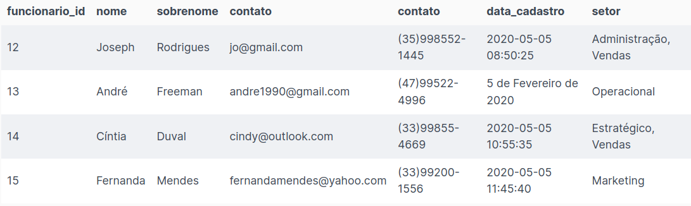
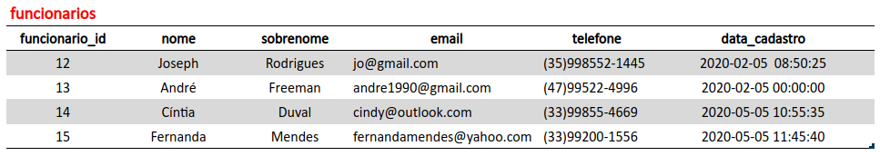
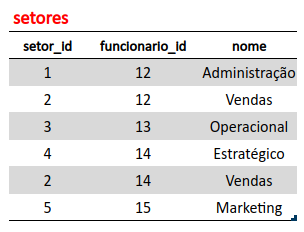
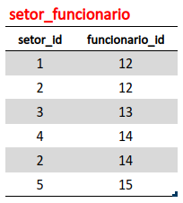

# ⚡ Atividades de Fixação & Exercícios | Bloco 21 - Dia 03 (Seção 03)

## ✅ Atividades de Fixação | Normalização de dados
1. Normalize a tabela a seguir para a 1ª Forma Normal.



R.: Primeiramente, deve-se corrigir os nomes das colunas que estão duplicados e o valor da coluna `data_cadastro` que não está conforme. Após isso, deve-se excluir a coluna `setor` da tabela em questão e criamos uma nova tabela. As novas tabelas poderão ser renomeadas para `funcionarios` e `setores`, respectivamente.





2. Usando a estrutura (já normalizada para 1ª Forma Normal) da tabela anterior, transforme-a agora na 2ª Forma Normal.

R.: Para atender a 2ª Forma Normal, deve-se remover as dependências parciais que existem na tabela `setores`. Sendo assim, é necessário remover dessa tabela a coluna `funcionario_id`  e a linha duplicada de `Vendas` (penúltima linha). Agora restaram somente as colunas `setor_id` e `nome`, sendo um id para cada nome, sem duplicidade. Para finalizar, criamos uma tabela intermediária, chamada `setor_funcionario`, que estabelece a conexão entre o funcionário e seu(s) setore(s) através dos respectivos ids. 





3. Monte uma query que:
- Crie um banco de dados chamado normalization;
- Crie todas as tabelas resultantes do exercício 2 (na 2ª Forma Normal);
- Popule todas as tabelas com os dados fornecidos nos exercícios.

```
CREATE DATABASE IF NOT EXISTS normalization;
USE normalization;

CREATE TABLE funcionarios(
	funcionario_id INT NOT NULL AUTO_INCREMENT PRIMARY KEY,
    nome VARCHAR(50) NOT NULL,
    sobrenome VARCHAR(100) NOT NULL,
    email VARCHAR(50) NOT NULL,
    telefone VARCHAR(20) NOT NULL,
    data_cadastro TIMESTAMP
)ENGINE=InnoDB;

INSERT INTO funcionarios(funcionario_id, nome, sobrenome, email, telefone, data_cadastro)
VALUES
	(12, 'Joseph', 'Rodrigues', 'jo@gmail.com', '(35)998552-1445', '2020-05-05 08:50:25'),
    (13, 'André', 'Freeman', 'andre1990@gmail.com', '(47)99522-4996', '2020-02-05 00:00:00'),
    (14, 'Cíntia', 'Duval', 'cindy@outlook.com', '(33)99855-4669', '2020-05-05 10:55:35'),
    (15, 'Fernanda', 'Mendes', 'fernandamendes@yahoo.com', '(33)99200-1556', '2020-05-05 11:45:40');


CREATE TABLE setores(
	setor_id INT NOT NULL AUTO_INCREMENT PRIMARY KEY,
	nome VARCHAR(100) NOT NULL
)ENGINE=InnoDB;

INSERT INTO setores(setor_id, nome)
VALUES
	(1, 'Administração'),
    (2, 'Vendas'),
    (3, 'Operacional'),
    (4, 'Estratégico'),
    (5, 'Marketing');


CREATE TABLE setor_funcionario(
  setor_id INT NOT NULL,
  funcionario_id INT NOT NULL,
  FOREIGN KEY (setor_id) REFERENCES setores(setor_id),
  FOREIGN KEY (funcionario_id) REFERENCES funcionarios(funcionario_id)
)ENGINE=InnoDB;

INSERT INTO setor_funcionario(setor_id, funcionario_id)
VALUES
	(1, 12),
    (2, 12),
    (3, 13),
    (4, 14),
    (2, 14),
    (5, 15);
```

4. Refaça o banco de dados `albuns`.

```
CREATE DATABASE IF NOT EXISTS albuns;
USE albuns;

CREATE TABLE genres(
	genre_id INT NOT NULL AUTO_INCREMENT PRIMARY KEY,
	name VARCHAR(100) NOT NULL
)ENGINE=InnoDB;

CREATE TABLE artists(
	artist_id INT NOT NULL AUTO_INCREMENT PRIMARY KEY,
	name VARCHAR(100) NOT NULL,
    genre_id INT NOT NULL,
    FOREIGN KEY (genre_id) REFERENCES genres(genre_id)
)ENGINE=InnoDB;

CREATE TABLE albums(
	album_id INT NOT NULL AUTO_INCREMENT PRIMARY KEY,
    name VARCHAR(100) NOT NULL,
    artist_id INT NOT NULL,
    genre_id INT NOT NULL,
    price DECIMAL(5,2) NOT NULL,
    release_year INT NOT NULL,
	FOREIGN KEY (artist_id) REFERENCES artists(artist_id),
	FOREIGN KEY (genre_id) REFERENCES genres(genre_id)
)ENGINE=InnoDB;

CREATE TABLE songs(
	song_id INT NOT NULL AUTO_INCREMENT PRIMARY KEY,
    name VARCHAR(100) NOT NULL,
    artist_id INT NOT NULL,
    album_id INT NOT NULL,
	FOREIGN KEY (artist_id) REFERENCES artists(artist_id),
	FOREIGN KEY (album_id) REFERENCES albums(album_id)
)ENGINE=InnoDB;
```