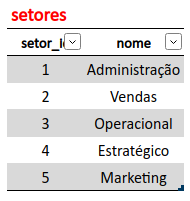
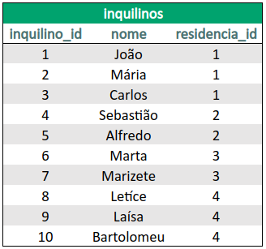

# ⚡ Atividades de Fixação & Exercícios | Bloco 21 - Dia 03 (Seção 03)

## ✅ Atividades de Fixação | Normalização de dados
1. Normalize a tabela a seguir para a 1ª Forma Normal.


R.: Primeiramente, deve-se corrigir os nomes das colunas que estão duplicados e o valor da coluna `data_cadastro` que não está conforme. Após isso, deve-se excluir a coluna `setor` da tabela em questão e criamos uma nova tabela. As novas tabelas poderão ser renomeadas para `funcionarios` e `setores`, respectivamente.


2. Usando a estrutura (já normalizada para 1ª Forma Normal) da tabela anterior, transforme-a agora na 2ª Forma Normal.

R.: Para atender a 2ª Forma Normal, deve-se remover as dependências parciais que existem na tabela `setores`. Sendo assim, é necessário remover dessa tabela a coluna `funcionario_id`  e a linha duplicada de `Vendas` (penúltima linha). Agora restaram somente as colunas `setor_id` e `nome`, sendo um id para cada nome, sem duplicidade. Para finalizar, criamos uma tabela intermediária, chamada `setor_funcionario`, que estabelece a conexão entre o funcionário e seu(s) setore(s) através dos respectivos ids. 




3. Monte uma query que:
- Crie um banco de dados chamado normalization;
- Crie todas as tabelas resultantes do exercício 2 (na 2ª Forma Normal);
- Popule todas as tabelas com os dados fornecidos nos exercícios.

```
CREATE DATABASE IF NOT EXISTS normalization;
USE normalization;

CREATE TABLE funcionarios(
  funcionario_id INT NOT NULL AUTO_INCREMENT PRIMARY KEY,
  nome VARCHAR(50) NOT NULL,
  sobrenome VARCHAR(100) NOT NULL,
  email VARCHAR(50) NOT NULL,
  telefone VARCHAR(20) NOT NULL,
  data_cadastro TIMESTAMP
)ENGINE=InnoDB;

INSERT INTO funcionarios(funcionario_id, nome, sobrenome, email, telefone, data_cadastro)
VALUES
  (12, 'Joseph', 'Rodrigues', 'jo@gmail.com', '(35)998552-1445', '2020-05-05 08:50:25'),
  (13, 'André', 'Freeman', 'andre1990@gmail.com', '(47)99522-4996', '2020-02-05 00:00:00'),
  (14, 'Cíntia', 'Duval', 'cindy@outlook.com', '(33)99855-4669', '2020-05-05 10:55:35'),
  (15, 'Fernanda', 'Mendes', 'fernandamendes@yahoo.com', '(33)99200-1556', '2020-05-05 11:45:40');


CREATE TABLE setores(
  setor_id INT NOT NULL AUTO_INCREMENT PRIMARY KEY,
  nome VARCHAR(100) NOT NULL
)ENGINE=InnoDB;

INSERT INTO setores(setor_id, nome)
VALUES
  (1, 'Administração'),
  (2, 'Vendas'),
  (3, 'Operacional'),
  (4, 'Estratégico'),
  (5, 'Marketing');


CREATE TABLE setor_funcionario(
  setor_id INT NOT NULL,
  funcionario_id INT NOT NULL,
  FOREIGN KEY (setor_id) REFERENCES setores(setor_id),
  FOREIGN KEY (funcionario_id) REFERENCES funcionarios(funcionario_id)
)ENGINE=InnoDB;

INSERT INTO setor_funcionario(setor_id, funcionario_id)
VALUES
  (1, 12),
  (2, 12),
  (3, 13),
  (4, 14),
  (2, 14),
  (5, 15);
```

4. Refaça o banco de dados `albuns`.

```
CREATE DATABASE IF NOT EXISTS albuns;
USE albuns;

CREATE TABLE genres(
  genre_id INT NOT NULL AUTO_INCREMENT PRIMARY KEY,
  name VARCHAR(100) NOT NULL
)ENGINE=InnoDB;

CREATE TABLE artists(
  artist_id INT NOT NULL AUTO_INCREMENT PRIMARY KEY,
  name VARCHAR(100) NOT NULL,
  genre_id INT NOT NULL,
    FOREIGN KEY (genre_id) REFERENCES genres(genre_id)
)ENGINE=InnoDB;

CREATE TABLE albums(
  album_id INT NOT NULL AUTO_INCREMENT PRIMARY KEY,
  name VARCHAR(100) NOT NULL,
  artist_id INT NOT NULL,
  genre_id INT NOT NULL,
  price DECIMAL(5,2) NOT NULL,
  release_year INT NOT NULL,
    FOREIGN KEY (artist_id) REFERENCES artists(artist_id),
    FOREIGN KEY (genre_id) REFERENCES genres(genre_id)
)ENGINE=InnoDB;

CREATE TABLE songs(
  song_id INT NOT NULL AUTO_INCREMENT PRIMARY KEY,
  name VARCHAR(100) NOT NULL,
  artist_id INT NOT NULL,
  album_id INT NOT NULL,
    FOREIGN KEY (artist_id) REFERENCES artists(artist_id),
    FOREIGN KEY (album_id) REFERENCES albums(album_id)
)ENGINE=InnoDB;
```

## ✅ Exercícios do Dia
1. Modele o banco de dados a seguir. 

Um zoológico precisa de um banco de dados para armazenar informações sobre os seus animais. As informações a serem armazenadas sobre cada animal são:
- Nome;
- Espécie;
- Sexo;
- Idade;
- Localização.

Cada animal também possui vários cuidadores, e cada cuidador pode ser responsável por mais de um animal. Além disso, cada cuidador possui um gerente, sendo que cada gerente pode ser responsável por mais de um cuidador.

✏️ Respostas abaixo...

**Entidades**
- Animals;
- Species;
- Locations;
- Keepers;
- Keepers e Animals;
- Managers.

**Atributos**
- Animals: animal_id, name, specie_id, sex, age e location_id;
- Species: specie_id e name;
- Locations: location_id e name;
- Keepers: keeper_id, name e manager_id;
- Keepers e Animals: keeper_id e animal_id;
- Managers: manager_id e name.

**Relacionamentos**


**Diagrama**


**Criação do Banco de Dados**
```
CREATE DATABASE IF NOT EXISTS zoo;
USE zoo;

CREATE TABLE locations(
  location_id INT NOT NULL AUTO_INCREMENT PRIMARY KEY,
  name VARCHAR(100) NOT NULL
)ENGINE=InnoDB;

CREATE TABLE species(
  specie_id INT NOT NULL AUTO_INCREMENT PRIMARY KEY,
  name VARCHAR(200) NOT NULL
)ENGINE=InnoDB;

CREATE TABLE animals(
  animal_id INT NOT NULL AUTO_INCREMENT PRIMARY KEY,
  name VARCHAR(100) NOT NULL,
  specie_id INT NOT NULL,
  sex VARCHAR(50) NOT NULL,
  age INT NOT NULL,
  location_id INT NOT NULL,
    FOREIGN KEY (specie_id) REFERENCES species(specie_id),
    FOREIGN KEY (location_id) REFERENCES locations(location_id)
)ENGINE=InnoDB;

CREATE TABLE managers(
  manager_id INT NOT NULL AUTO_INCREMENT PRIMARY KEY,
  name VARCHAR(100) NOT NULL
)ENGINE=InnoDB;

CREATE TABLE keepers(
  keeper_id INT NOT NULL AUTO_INCREMENT PRIMARY KEY,
  name VARCHAR(100) NOT NULL,
  manager_id INT NOT NULL,
    FOREIGN KEY (manager_id) REFERENCES managers(manager_id)
)ENGINE=InnoDB;

CREATE TABLE keeper_animal(
  keeper_id INT NOT NULL,
  animal_id INT NOT NULL,
  CONSTRAINT PRIMARY KEY(keeper_id, animal_id),
    FOREIGN KEY (keeper_id) REFERENCES keepers(keeper_id),
    FOREIGN KEY (animal_id) REFERENCES animals(animal_id)
)ENGINE=InnoDB;
```

2. Converta a tabela desnormalizada abaixo para a 1ª Forma Normal.


R.: Para atender a 1ª Forma Normal, deve-se corrigir duas colunas da tabela: `endereco` e `inquilinos`. A coluna `endereco` foi convertida em 4 colunas, cada uma constando uma informação pertinente ao endereço. Já a coluna `inquilino` foi excluída da tabela `residencias` e fora criado uma tabela a partir dela, chamada `inquilinos`. Nessa nova tabela, fora atribuído um id para cada inquilino, além de referenciar seu nome e o id de sua residência.





3. Converta a tabela desnormalizada abaixo (que já está nos padrões da 1ª Forma Normal) para a 2ª Forma Normal.


R.: Para atender a 2ª Forma Normal, as colunas `liga`, `universo`, `criador` e `criador_idade` foram convertidas em tabelas. As duas últimas colunas estão na mesma tabela, conforme as imagens abaixo. 


4. Agora, converta essa outra tabela (que já está nos moldes das duas primeiras formas) para a 3ª Forma Normal.


R.: Para atender a 3ª Forma Normal, a tabela `generos` foi criada, cujas colunas possuem unicamente informações dos generos de filmes. Dessa forma, foi possível excluir a coluna `genero` da tabela `filmes`, mantendo somente a coluna `genero_id`.


## ✅ (TÓPICO BÔNUS) Atividades de Fixação | DUMPs
- Obs.: Foi utilizado o banco de dados `northwind` nas atividades a seguir. Além disso, todos os comandos foram executados dentro de uma pasta de backup.

1. Exporte a estrutura e os dados (tabelas, triggers, procedures, functions e o schema) para um dump em formato de arquivo SQL, como foi exibido nas instruções anteriores. Faça o dump através da linha de comando e usando o MySQL Workbench.
```
mysqldump -u root -p northwind > northwindBackup.sql
```

2. Após ter feito isso, abra o arquivo usando algum editor de texto e altere as duas linhas iniciais, mudando o nome do banco a ser criado e do banco a ser usado. Assim seu script vai restaurar um banco novo e não sobrescrever o atual.
```
<!-- Foram adicionadas as linhas a seguir no início do arquivo de dump -->

CREATE DATABASE IF NOT EXISTS `northwind2`
USE `northwind2`;
```

3. Restaure o backup do banco de dados criado por você.
```
mysql -u root -p < northwindBackup.sql
```

## ✅ (TÓPICO BÔNUS) Exercícios | VIEWS
1. Crie uma view chamada `film_with_categories` utilizando as tabelas `category`, `film_category` e `film` do banco de dados `sakila`. Essa view deve exibir o título do filme, o id da categoria e o nome da categoria. Os resultados devem ser ordenados pelo título do filme.
```
CREATE VIEW film_with_categories AS
SELECT
  f.title AS film_title,
  fc.category_id,
  c.name AS category_name
FROM sakila.film_category AS fc
INNER JOIN sakila.film AS f
  ON fc.film_id = f.film_id
INNER JOIN sakila.category AS c
  ON fc.category_id = c.category_id
ORDER BY film_title;
```

2. Crie uma view chamada `film_info` utilizando as tabelas `actor`, `film_actor` e `film` do banco de dados `sakila`. Sua view deve exibir o `actor_id`, o nome completo do ator ou da atriz em uma coluna com o `ALIAS` `actor` e o título dos filmes. Os resultados devem ser ordenados pelos nomes de atores e atrizes.
```
CREATE VIEW film_info AS
SELECT
  a.actor_id,
  CONCAT(a.first_name, ' ', a.last_name) AS actor,
  title AS film_title
FROM sakila.film_actor AS fa
INNER JOIN sakila.actor AS a
  ON fa.actor_id = a.actor_id
INNER JOIN sakila.film AS f
  ON fa.film_id = f.film_id
ORDER BY actor;
```

3. Crie uma view chamada `address_info` que faça uso das tabelas `address` e `city` do banco de dados `sakila`. Sua view deve exibir o `address_id`, o `address`, o `district`, o `city_id` e a `city`. Os resultados devem ser ordenados pelo nome das cidades.
```
CREATE VIEW address_info AS
SELECT
  a.address_id,
  a.address,
  a.district,
  c.city_id,
  c.city
FROM sakila.address AS a 
  INNER JOIN sakila.city AS c
  ON a.city_id = c.city_id
ORDER BY c.city;
```

4. Crie uma view chamada `movies_languages`, usando as tabelas `film` e `language` do banco de dados `sakila`. Sua view deve exibir o título do filme, o id do idioma e o idioma do filme.
```
CREATE VIEW movies_languages AS
SELECT
  f.title AS film_title,
  l.language_id,
  l.name AS language
FROM sakila.film AS f 
  INNER JOIN sakila.language AS l
  ON f.language_id = l.language_id;
```

## ✅ (TÓPICO BÔNUS) Exercícios | INDEX
1. Verifique o impacto de um `FULLTEXT INDEX` na tabela `category` (banco de dados `sakila`), adicionando-o na coluna `name`. Após ter adicionado o índice, mensure o custo da query utilizando o execution plan. Após ter criado e mensurado o custo da query, exclua o índice e mensure novamente esse custo.
```
-- Após ter criado o índice, mensure o custo com a seguinte query:
SELECT *
FROM sakila.category
WHERE MATCH(name) AGAINST('action');

-- Após ter excluído o índice, mensure o custo com a seguinte query:
SELECT *
FROM sakila.category
WHERE name LIKE '%action%';
```

✏️ Respostas abaixo...
- Criação do index:
```
CREATE FULLTEXT INDEX index_name ON sakila.category(name);
```
- Exclusão do index:
```
DROP INDEX index_name ON sakila.category;
```
- Diferença entre custos das queries: Com o index aplicado, o query cost foi de 0.35, enquanto sem o index o query cost foi de 1.85. Nesta situação, a aplicação do index melhorou a performance da query.

2. Verifique o impacto de um `INDEX` na tabela `address` (banco de dados `sakila`) adicionando-o na coluna `postal_code`. Após ter adicionado o índice, mensure o custo da query utilizando o execution plan. Após ter criado e mensurado o custo da query, exclua o índice e mensure novamente esse custo.
```
-- Mensure o custo com a seguinte query:
SELECT *
FROM sakila.address
WHERE postal_code = '36693';
```

✏️ Respostas abaixo...
- Criação do index:
```
CREATE INDEX index_postal_code ON sakila.address(postal_code);
```
- Exclusão do index:
```
DROP INDEX index_postal_code ON sakila.address;
```
- Diferença entre custos das queries: Com o index aplicado, o query cost foi de 0.35, enquanto sem o index o query cost foi de 61.80. Como no caso anterior, a aplicação do index melhorou a performance da query.

## ✅ (TÓPICO BÔNUS) Exercícios | ALTER TABLE
- Para os exercícios a seguir, será ultizado o banco de dados `hr`.
1. Escreva uma query SQL para alterar na tabela `locations` o nome da coluna `street_address` para `address`, mantendo o mesmo tipo e tamanho de dados.
```
ALTER TABLE hr.locations RENAME COLUMN street_address TO address;
```

2. Escreva uma query SQL para alterar na tabela `regions` o nome da coluna `region_name` para `region`, mantendo o mesmo tipo e tamanho de dados.
```
ALTER TABLE hr.regions RENAME COLUMN region_name TO region;
```

3. Escreva uma query SQL para alterar na tabela `countries` o nome da coluna `country_name` para `country`, mantendo o mesmo tipo e tamanho de dados.
```
ALTER TABLE hr.countries RENAME COLUMN country_name TO country;
```